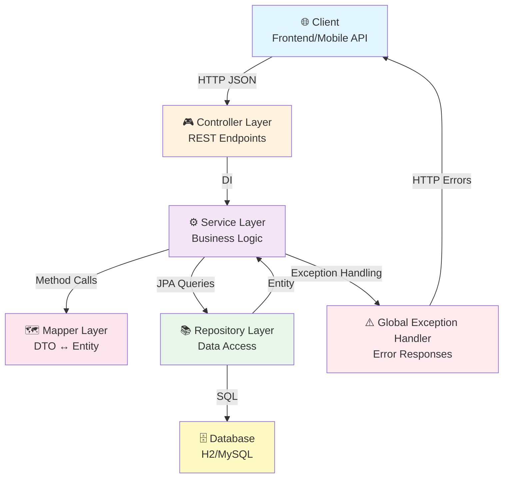
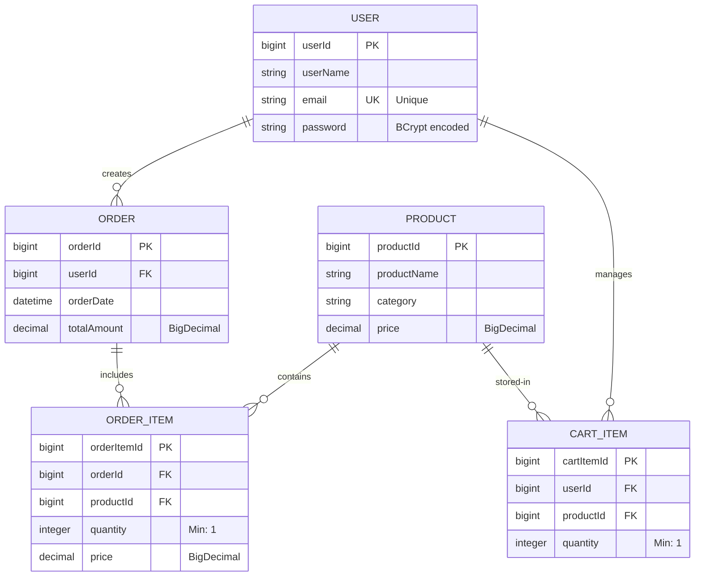
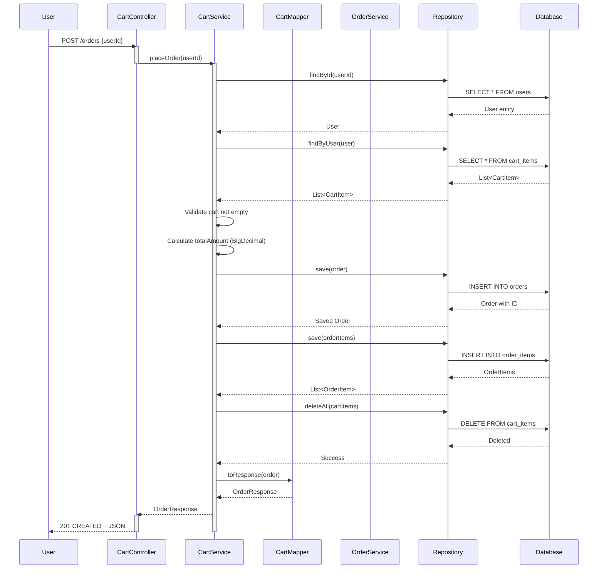
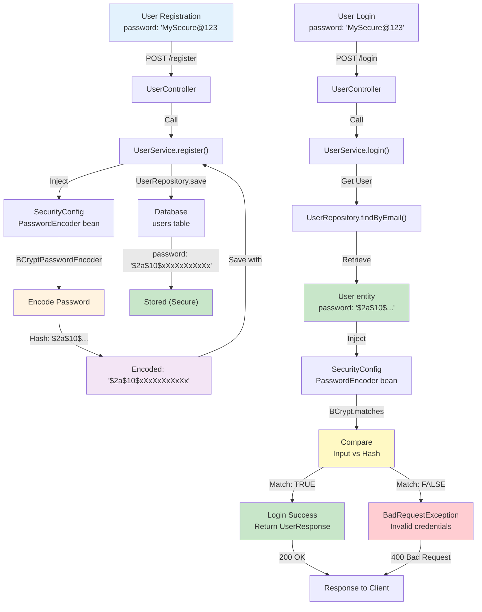
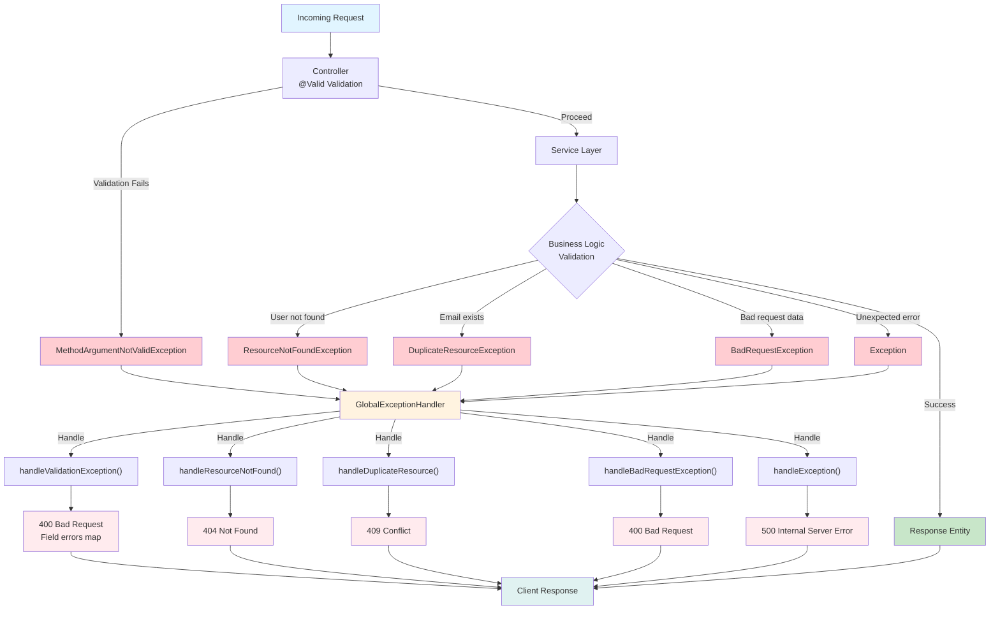

# E-Commerce Platform - Visual Mermaid Diagrams

## 1. SYSTEM ARCHITECTURE (Layer Diagram)



## 2. ENTITY RELATIONSHIP DIAGRAM



## 3. CONTROLLER-SERVICE-REPOSITORY FLOW

```mermaid
graph LR
    subgraph Controllers
        UC["UserController<br/>POST,GET,PUT,DELETE"]
        PC["ProductController<br/>POST,GET,PUT,DELETE"]
        OC["OrderController<br/>POST,GET"]
        CC["CartController<br/>POST,GET,PUT,DELETE"]
    end

    subgraph Services
        US["UserService<br/>register, login<br/>getUser, updateUser"]
        PS["ProductService<br/>createProduct<br/>searchProducts"]
        OS["OrderService<br/>placeOrder<br/>getOrderHistory"]
        CS["CartService<br/>addToCart<br/>updateCart"]
    end

    subgraph Repositories
        UR["UserRepository<br/>findByEmail"]
        PR["ProductRepository<br/>findByCategory<br/>findByProductName"]
        OR["OrderRepository<br/>findByUser<br/>findById"]
        CR["CartRepository<br/>findByUser<br/>deleteAll"]
    end

    UC -->|@Autowired| US
    PC -->|@Autowired| PS
    OC -->|@Autowired| OS
    CC -->|@Autowired| CS

    US -->|@Autowired| UR
    PS -->|@Autowired| PR
    OS -->|@Autowired| OR
    CS -->|@Autowired| CR

    UR -.->|Extends| JPARepo["JpaRepository"]
    PR -.->|Extends| JPARepo
    OR -.->|Extends| JPARepo
    CR -.->|Extends| JPARepo

    JPARepo -->|Uses| Database["H2 Database"]
```

## 4. API ENDPOINT TREE

```mermaid
graph TD
    API["🚀 /api"]
    
    API --> Users["👤 /users"]
    API --> Products["📦 /products"]
    API --> Orders["📋 /orders"]
    API --> Cart["🛒 /cart"]
    
    Users --> UPost["POST /register<br/>UserRequest → UserResponse<br/>201 Created"]
    Users --> UPost2["POST /login<br/>LoginRequest → UserResponse<br/>200 OK"]
    Users --> UGet["GET /{id}<br/>→ UserResponse<br/>200 OK"]
    Users --> UPut["PUT /{id}<br/>UserRequest → UserResponse<br/>200 OK"]
    Users --> UDel["DELETE /{id}<br/>→ 204 No Content"]
    
    Products --> PPost["POST<br/>ProductRequest → ProductResponse<br/>201 Created"]
    Products --> PGet["GET /{id}<br/>→ ProductResponse<br/>200 OK"]
    Products --> PList["GET /page?page=0&size=10<br/>→ Page<ProductResponse><br/>200 OK"]
    Products --> PCategory["GET /category/{cat}?page=0<br/>→ Page<ProductResponse><br/>200 OK"]
    Products --> PSearch["GET /search?keyword=x<br/>→ Page<ProductResponse><br/>200 OK"]
    Products --> PPut["PUT /{id}<br/>ProductRequest → ProductResponse<br/>200 OK"]
    Products --> PDel["DELETE /{id}<br/>→ 204 No Content"]
    
    Orders --> OPost["POST<br/>userId → OrderResponse<br/>201 Created"]
    Orders --> OHistory["GET /history/{userId}<br/>→ List<OrderResponse><br/>200 OK"]
    Orders --> OGet["GET /{orderId}<br/>→ OrderResponse<br/>200 OK"]
    
    Cart --> CPost["POST<br/>AddCartRequest → CartResponse<br/>201 Created"]
    Cart --> CGet["GET /{userId}<br/>→ List<CartResponse><br/>200 OK"]
    Cart --> CPut["PUT /{cartItemId}<br/>UpdateCartRequest → CartResponse<br/>200 OK"]
    Cart --> CDel["DELETE /{cartItemId}<br/>→ 204 No Content"]
    Cart --> CClear["DELETE /clear/{userId}<br/>→ 204 No Content"]
    
    style API fill:#1976d2,color:#fff
    style Users fill:#388e3c,color:#fff
    style Products fill:#d32f2f,color:#fff
    style Orders fill:#f57c00,color:#fff
    style Cart fill:#7b1fa2,color:#fff
```



## 5. ORDER CREATION DATA FLOW



## 6. PASSWORD ENCODING FLOW



## 7. EXCEPTION HANDLING FLOW



## 8. TECHNOLOGY STACK VISUALIZATION

```mermaid
graph TD
    A["🚀 E-Commerce Platform"]
    
    A --> Backend["Backend Framework"]
    Backend --> Java["Java 21"]
    Backend --> SpringBoot["Spring Boot 4.1.0"]
    SpringBoot --> Web["Spring Web"]
    SpringBoot --> JPA["Spring Data JPA"]
    SpringBoot --> Security["Spring Security"]
    SpringBoot --> Validation["Spring Validation"]
    
    A --> Database["Database Layer"]
    Database --> H2["H2 Database<br/>In-Memory"]
    Database --> MySQL["MySQL<br/>Production"]
    Database --> Hibernate["Hibernate ORM"]
    
    A --> Libraries["Core Libraries"]
    Libraries --> Lombok["Lombok<br/>Code Generation"]
    Libraries --> Jackson["Jackson<br/>JSON Processing"]
    Libraries --> JUnit["JUnit 5<br/>Testing"]
    
    A --> Build["Build & Deployment"]
    Build --> Maven["Maven 3.x"]
    Build --> Dependencies["Dependency Management"]
    
    A --> Security2["Security"]
    Security2 --> BCrypt["BCrypt<br/>Password Hashing"]
    Security2 --> InputVal["Input Validation<br/>Jakarta Validation"]
    
    style A fill:#1976d2,color:#fff,stroke:#0d47a1,stroke-width:3px
    style Backend fill:#388e3c,color:#fff
    style Database fill:#d32f2f,color:#fff
    style Libraries fill:#f57c00,color:#fff
    style Build fill:#7b1fa2,color:#fff
    style Security2 fill:#c2185b,color:#fff
    style Java fill:#fff3e0
    style SpringBoot fill:#fff3e0
    style H2 fill:#c8e6c9
    style MySQL fill:#c8e6c9
    style Lombok fill:#b2dfdb
    style Jackson fill:#b2dfdb
    style JUnit fill:#b2dfdb
    style BCrypt fill:#ffccbc
    style InputVal fill:#ffccbc
```



---

**Visual diagrams generated on:** 2026-07-29  
**Format:** Mermaid Diagram Syntax (Compatible with GitHub, GitLab, Notion, etc.)
